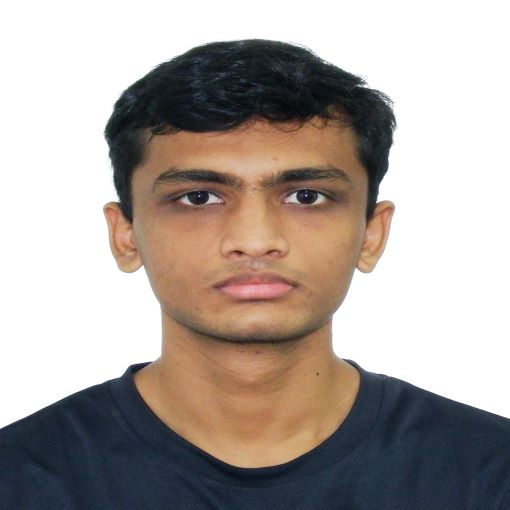
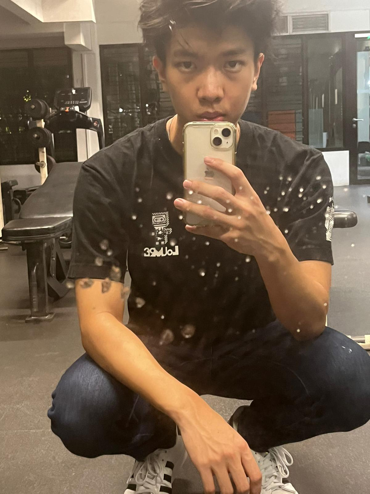

We are a team based in the [School of Computing, National University of Singapore](http://www.comp.nus.edu.sg).

You can reach us at the email `seer[at]comp.nus.edu.sg`

## Project team

### Immanuel Chia

[[homepage](http://www.comp.nus.edu.sg/~damithch)]
[[github](https://github.com/HEEaZ)]
[[portfolio](team/johndoe.md)]

* Role: Developer

### Vijayaraghavan Vishnuprasath

[[github](http://github.com/timetraveller-123)]
[[portfolio](team/timetraveller-123.md)]

* Role: Team Lead
* Responsibilities: Code Quality and Documentation.

### Yin Joe Ng

[[github](http://github.com/joeng03)] [[portfolio](team/joeng03.md)]

* Role: Developer
* Responsibilities: Data

### Lin Wan Lei

[[github](http://github.com/linwanleii)]
[[portfolio](team/johndoe.md)]

* Role: Developer
* Responsibilities: Dev Ops + Threading

### James Doe

[[github](http://github.com/johndoe)]
[[portfolio](team/johndoe.md)]

* Role: Developer
* Responsibilities: UI
