##Table of Contents
1. [Acknowledgements](#acknowledgements)
2. [Setting up](#setting-up-getting-started)
3. [Design](#design)
    1. [Architecture](#architecture)
    2. [UI](#ui-component)
    3. [Logic](#logic-component)
    4. [Model](#model-component)
    5. [Storage](#storage-component)
    6. [Common Classes](#common-classes)
4. [Implementation](#implementation)
5. [Documentation](#documentation-logging-testing-configuration-dev-ops)
6. [Appendix: Requirements](#appendix-requirements)
    1. [Product scope](#product-scope)
    2. [User Stories](#user-stories)
    3. [Use Cases](#use-cases)
    4. [Non-Functional Requirements](#non-functional-requirements)
7. [Appendix: Instruction for Manual Testing](#appendix-instructions-for-manual-testing)
8. [Appendix: Planned Enhancements](#appendix-planned-enhancements)
9. [Appendix: Effort](#appendix-effort)
10. [Glossary](#glossary)
--------------------------------------------------------------------------------------------------------------------

## **Acknowledgements**

PharmHub is built upon [AddressBook-Level3](https://se-education.org/addressbook-level3/) project created by the [SE-EDU initiative](https://se-education.org).  
The following libraries have been used
* [JavaFX](https://openjfx.io/)
* [Jackson](https://github.com/FasterXML/jackson) 
* [JUnit5](https://junit.org/junit5/)

--------------------------------------------------------------------------------------------------------------------

## **Setting up, getting started**

Refer to the guide [_Setting up and getting started_](SettingUp.md).

--------------------------------------------------------------------------------------------------------------------

## **Design**

<div markdown="span" class="alert alert-primary">

:bulb: **Tip:** The `.puml` files used to create diagrams in this document `docs/diagrams` folder. Refer to the [_PlantUML Tutorial_ at se-edu/guides](https://se-education.org/guides/tutorials/plantUml.html) to learn how to create and edit diagrams.
</div>

### Architecture


The ***Architecture Diagram*** given above explains the high-level design of the App.

Given below is a quick overview of main components and how they interact with each other.

**Main components of the architecture**

**`Main`** (consisting of classes [`Main`](https://github.com/AY2324S1-CS2103T-W08-4/tp/tree/master/src/main/java/seedu/address/Main.java) and [`MainApp`](https://github.com/AY2324S1-CS2103T-W08-4/tp/tree/master/src/main/java/seedu/address/MainApp.java)) is in charge of the app launch and shut down.
* At app launch, it initializes the other components in the correct sequence, and connects them up with each other.
* At shut down, it shuts down the other components and invokes cleanup methods where necessary.

The bulk of the app's work is done by the following four components:

* [**`UI`**](#ui-component): The UI of the App.
* [**`Logic`**](#logic-component): The command executor.
* [**`Model`**](#model-component): Holds the data of the App in memory.
* [**`Storage`**](#storage-component): Reads data from, and writes data to, the hard disk.

[**`Commons`**](#common-classes) represents a collection of classes used by multiple other components.

**How the architecture components interact with each other**

The *Sequence Diagram* below shows how the components interact with each other for the scenario where the user issues the command `delete 1`.


Each of the four main components (also shown in the diagram above),

* defines its *API* in an `interface` with the same name as the Component.
* implements its functionality using a concrete `{Component Name}Manager` class (which follows the corresponding API `interface` mentioned in the previous point.

For example, the `Logic` component defines its API in the `Logic.java` interface and implements its functionality using the `LogicManager.java` class which follows the `Logic` interface. Other components interact with a given component through its interface rather than the concrete class (reason: to prevent outside component's being coupled to the implementation of a component), as illustrated in the (partial) class diagram below.


The sections below give more details of each component.

### UI component

The **API** of this component is specified in [`Ui.java`](https://github.com/AY2324S1-CS2103T-W08-4/tp/tree/master/src/main/java/seedu/address/ui/Ui.java)

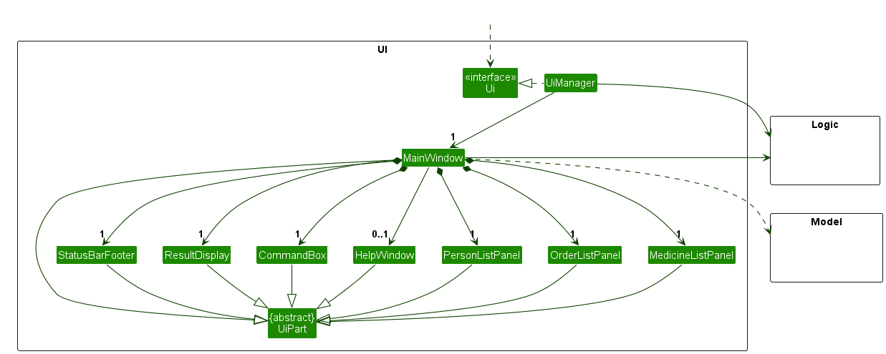

The UI consists of a `MainWindow` that is made up of parts e.g.`CommandBox`, `ResultDisplay`, `PersonListPanel`, `StatusBarFooter` etc. All these, including the `MainWindow`, inherit from the abstract `UiPart` class which captures the commonalities between classes that represent parts of the visible GUI.

The `UI` component uses the JavaFx UI framework. The layout of these UI parts are defined in matching `.fxml` files that are in the `src/main/resources/view` folder. For example, the layout of the [`MainWindow`](https://github.com/AY2324S1-CS2103T-W08-4/tp/tree/master/src/main/java/seedu/address/ui/MainWindow.java) is specified in [`MainWindow.fxml`](https://github.com/AY2324S1-CS2103T-W08-4/tp/tree/master/src/main/resources/view/MainWindow.fxml)

The `UI` component,

* executes user commands using the `Logic` component.
* listens for changes to `Model` data so that the UI can be updated with the modified data.
* keeps a reference to the `Logic` component, because the `UI` relies on the `Logic` to execute commands.
* depends on some classes in the `Model` component, as it displays `Person` object residing in the `Model`.

### Logic component

**API** : [`Logic.java`](https://github.com/AY2324S1-CS2103T-W08-4/tp/tree/master/src/main/java/seedu/address/logic/Logic.java)

Here's a (partial) class diagram of the `Logic` component:

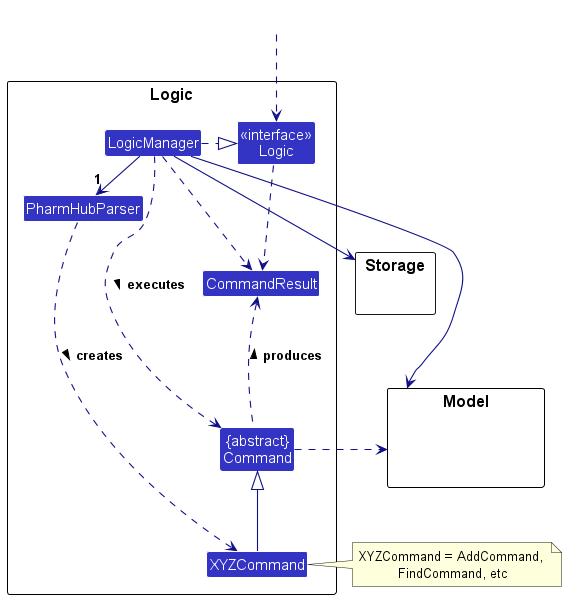

The sequence diagram below illustrates the interactions within the `Logic` component, taking `execute("delete 1")` API call as an example.


<div markdown="span" class="alert alert-info">:information_source: **Note:** The lifeline for `DeleteCommandParser` should end at the destroy marker (X) but due to a limitation of PlantUML, the lifeline reaches the end of diagram.
</div>

How the `Logic` component works:

1. When `Logic` is called upon to execute a command, it is passed to an `PharmHubParser` object which in turn creates a parser that matches the command (e.g., `DeleteCommandParser`) and uses it to parse the command.
1. This results in a `Command` object (more precisely, an object of one of its subclasses e.g., `DeleteCommand`) which is executed by the `LogicManager`.
1. The command can communicate with the `Model` when it is executed (e.g. to delete a person).
1. The result of the command execution is encapsulated as a `CommandResult` object which is returned back from `Logic`.

Here are the other classes in `Logic` (omitted from the class diagram above) that are used for parsing a user command:

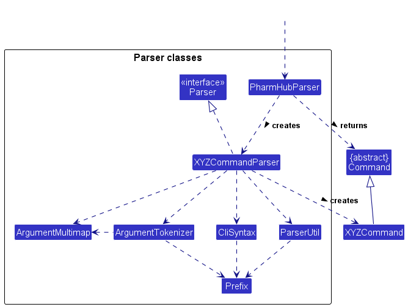

How the parsing works:
* When called upon to parse a user command, the `PharmHubParser` class creates an `XYZCommandParser` (`XYZ` is a placeholder for the specific command name e.g., `AddCommandParser`) which uses the other classes shown above to parse the user command and create a `XYZCommand` object (e.g., `AddCommand`) which the `PharmHubParser` returns back as a `Command` object.
* All `XYZCommandParser` classes (e.g., `AddCommandParser`, `DeleteCommandParser`, ...) inherit from the `Parser` interface so that they can be treated similarly where possible e.g, during testing.

### Model component
**API** : [`Model.java`](https://github.com/AY2324S1-CS2103T-W08-4/tp/tree/master/src/main/java/seedu/address/model/Model.java)

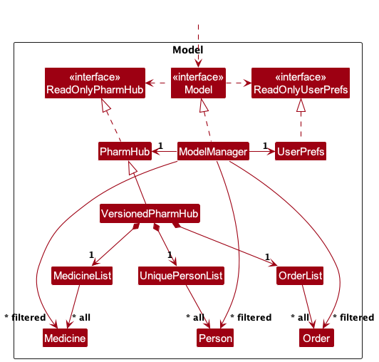


The `Model` component,

* stores the PharmHub data i.e., all `Person` objects (which are contained in a `UniquePersonList` object).
* stores the currently 'selected' `Person` objects (e.g., results of a search query) as a separate _filtered_ list which is exposed to outsiders as an unmodifiable `ObservableList<Person>` that can be 'observed' e.g. the UI can be bound to this list so that the UI automatically updates when the data in the list change.
* stores a `UserPref` object that represents the user’s preferences. This is exposed to the outside as a `ReadOnlyUserPref` objects.
* does not depend on any of the other three components (as the `Model` represents data entities of the domain, they should make sense on their own without depending on other components)

<div markdown="span" class="alert alert-info">:information_source: **Note:** An alternative (arguably, a more OOP) model is given below. It has a `Tag` list in the `PharmHub`, which `Person` references. This allows `PharmHub` to only require one `Tag` object per unique tag, instead of each `Person` needing their own `Tag` objects.<br>


</div>


### Storage component

**API** : [`Storage.java`](https://github.com/AY2324S1-CS2103T-W08-4/tp/tree/master/src/main/java/seedu/address/storage/Storage.java)

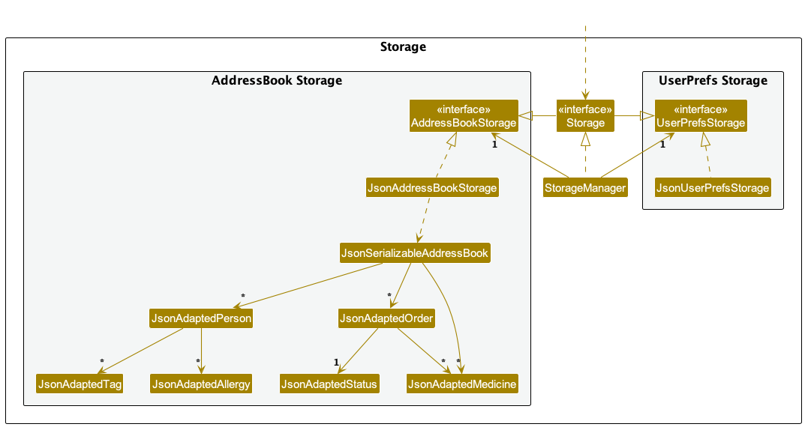

The `Storage` component,
* can save both PharmHub data and user preference data in JSON format, and read them back into corresponding objects.
* inherits from both `PharmHubStorage` and `UserPrefStorage`, which means it can be treated as either one (if only the functionality of only one is needed).
* depends on some classes in the `Model` component (because the `Storage` component's job is to save/retrieve objects that belong to the `Model`)
    * The Main Application has 3 JsonAdapted component in storage: `JsonAdaptedPerson`, `JsonAdaptedOrder`, `JsonAdaptedMedicine`.
      * `JsonAdaptedPerson` further contains `JsonAdaptedTag` and `JsonAdaptedAllergy`.
      * `JsonAdaptedOrder` further contains `JsonAdaptedStatus` and `JsonAdaptedMedicine`.`

### Common classes

Classes used by multiple components are in the `seedu.pharmHub.commons` package.

--------------------------------------------------------------------------------------------------------------------

## **Implementation**

This section describes some noteworthy details on how certain features are implemented. 

### Add medicine short form feature  

#### Implementation
After the creation of new `Medicine`, a short form can be assigned to that `Medicine` using the `sfm` command.  
After this command, the user would be able to use this short form interchangeably with the full name in fields requiring medicine or allergy names.    
Currently, only one short form can be assigned to one `Medicine` at a time.  

#### Steps to trigger
Step 1: The User launches the application.
Step 2: The user executes `sfm 1 m/pan` to add the short form of `pan` to the medicine at index 1 in the last shown medicine list.  
Step 3: Logic Manager calls `AddressBookParser#parse` which extracts the arguments and calls `ShortFormCommandParser`  
Step 4: `ShortFormCommandParser` parses the index, short form name and returns a `ShortFormComamnd`   
Step 5: `LogicManager` calls `ShortFormCommand#execute` to assign the short form to the medicine.   
Step 6: `ShortFormCommand` checks if an existing medicine with the same name or same short form is already present using `Model#hasMedicine(m)`.   
Step 7: The `Medicine` at index 1 is replaced with a new `Medicine` which has same medicine name but with `pan` as the short form.   

The following sequence diagram illustrates some of the steps that happen when user execute `sfm 1 m/pan`

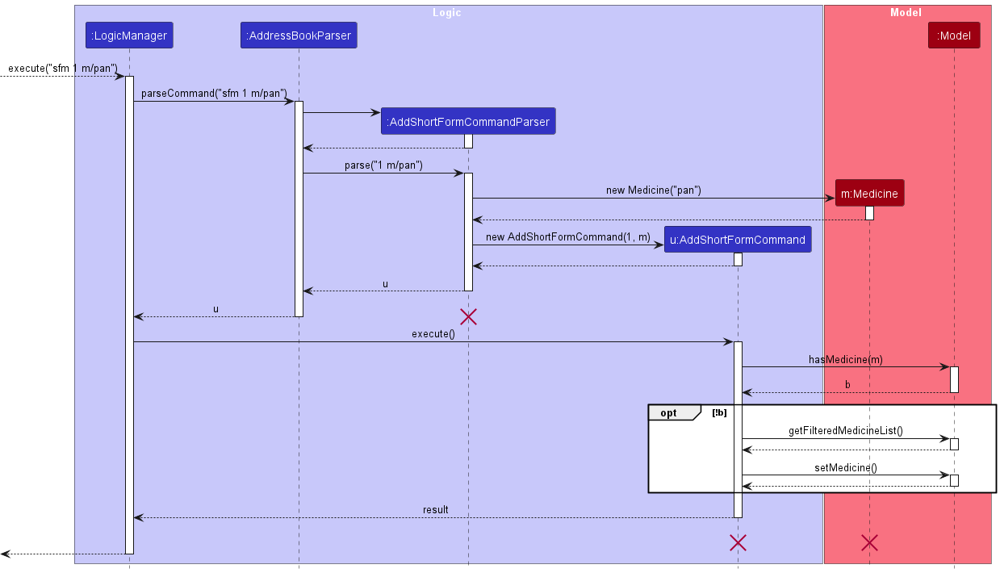
<div markdown="span" class="alert alert-info">:information_source: **Note:** The lifelines should end at the destroy marker (X) but due to a limitation of PlantUML, the lifeline reaches the end of diagram.
</div>  
 
`Model#hasMedicine(m)` utilizes the following method `Medicine#isSameMedicine` to check equality of two `Medicine`.  
```java
public boolean isSameMedicine(Medicine m) {
        if (m == this) {
            return true;
        }
        if (m == null) {
            return false;
        }
        return (medicineName.equalsIgnoreCase(m.medicineName)
                || medicineName.equalsIgnoreCase(m.shortForm)
                || m.medicineName.equalsIgnoreCase(shortForm));
}
```

### Delete medicine short form feature  
#### Implementation
`sfm` can also be used to delete the short form of a medicine by providing the `d/` flag.
If the `d/` flag is provided any provided medicine names using `m/` will be ignored.   
Hence `sfm 1 m/pan d/` will
be treated as deleting the short form of medicine at index 1 in the last shown medicine list. 

#### Steps to trigger
Given below is an example scenario to delete the short form of medicine at index 1. 

Step 1. The user lists all medicines using the `listm` command.  
Step 2. The user deletes the medicine at 1st index using `sfm 1 m/pan d/`  
Step 3: Logic Manager calls `AddressBookParser#parse` which extracts the arguments and calls `ShortFormCommandParser`  
Step 4: `ShortFormCommandParser` parses the index, ignores the short form and returns a `ShortFormComamnd`   
Step 5: `LogicManager` calls `ShortFormCommand#execute` to delete the short form of medicine at index 1.   
Step 6: The `Medicine` at index 1 is replaced with a new `Medicine` which has same medicine name but with no short form.


The following activity diagram summarises the sequence of steps for the whole `sfm` command.

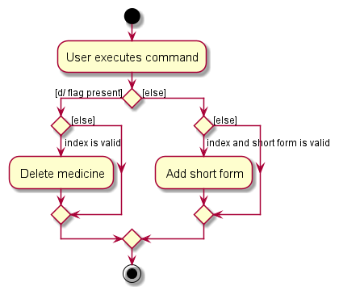

### Adding an Order feature

#### Implementation

The adding an Order feature allows the user to add an order to a person.
<br>
1. The add order feature includes the ignore allergy flag to allow further flexibility for the pharmacist when assigning orders
   to people. This is because they may have other considerations when it comes to assigning a medication for a person.
2. The add order feature do not allow duplicated order as we believe that each order should be distinct base on
   their order number, ensuring that no orders go missing or forgotten.

#### Steps to Trigger

1. The User launches the application.
2. The User executes "addo 1 m/aspirin o/1" to add a new order.
3. The `AddOrderParser#parse()` checks whether all the prefixes and the required values are provided.
4. If the check is successful, the `ParseUtil#parseOrderNumber`, `ParseUtil#parseOrderNumber` and `ParseUtil#parseMedicine` 
will then check and create an `Index`, `OrderNumber` and `Medicine` passing it to `AddOrderCommand`.
5. Depending on whether an ignore allergy flag `ia/` is added in the command input, user can input medications in the order that the person is allergic to. 
6. `AddOrderCommand#execute` then checks if the person exist base on index and creates an Order with the
`person`, `orderNumber`, `medicine` and a `PENDING` Status, then `Model#hasOrder` also checks whether the order is a duplicated order.
7. If the order does not exist, then the `Model#addOrder` adds the order into the order list.

#### Design Consideration

The following sequence diagram shows how `addo` works on an example input. `addo 1 m/aspirin o/1000`

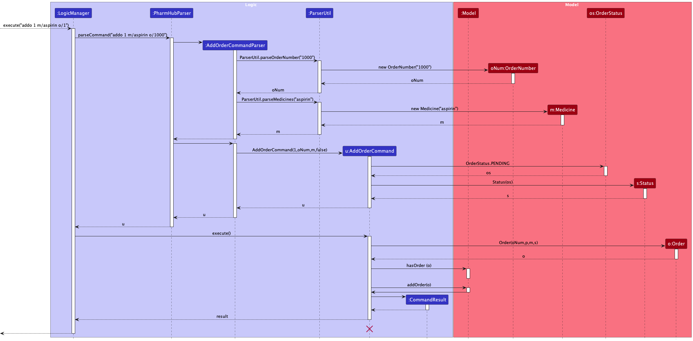

### Finding an Order Feature

#### Implementation

The finding an Order feature allows the user to find other base on either the orderStatus, medication in the order or both.
<br>
1. The find order feature allows independent Predicate finding.
    1. i.e. you can find order base on only `Status` or `Medicine`.
    2. We implemented this format to expend the utility of the feature.

#### Steps to Trigger

1. The User Launches the application. 
2. The User decides to find/filter through the order list after adding multiple orders.
3. The User executes "findo s/pd m/pan ibuprofen" to find orders that has `PENDING` status and either `PANADOL` or `IBUPROFEN` in the order.
4. The `FindOrderCommandParser#parse()` checks whether all the prefixes and the required values are provided.
5. If the check is successful, depending on the User input if `s/` is present `ParseUtil#parseStatus` will return a
`Status`, and if `m/` is present `ParseUtil#parseMedicines` will return the `Medicine/s`.
6. The `Status` and `Medicine` will then be passed to the FindOrderCommand.
7. The `Model#updateFilteredOrder` will then take either or both `Status` and `Medicine` as predicates to filter through the order list and return valid orders.
8. The filtered order list will then be returned and shown on the Displayed list.

#### Design Consideration

The following sequence diagram shows how `findo` works on an example input. `findo s/pd m/pan ibuprofen`

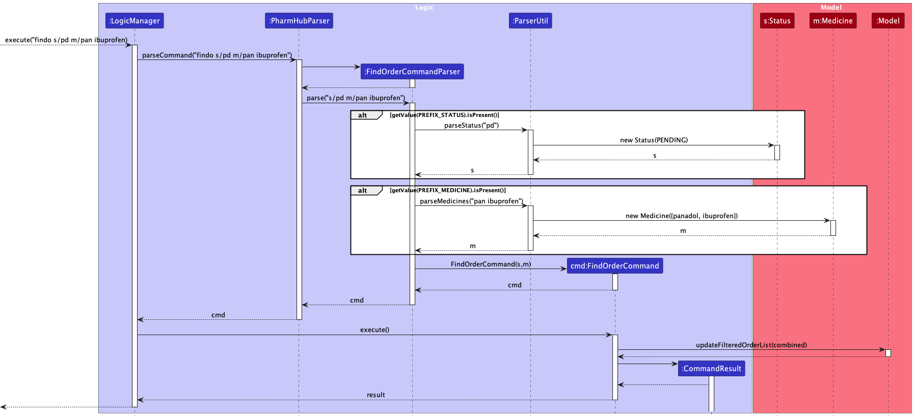

### \[Proposed\] Undo/redo feature

#### Proposed Implementation

The proposed undo/redo mechanism is facilitated by `VersionedPharmHub`. It extends `PharmHub` with an undo/redo history, stored internally as an `pharmHubStateList` and `currentStatePointer`. Additionally, it implements the following operations:

* `VersionedPharmHub#commit()` — Saves the current pharmHub state in its history.
* `VersionedPharmHub#undo()` — Restores the previous pharmHub state from its history.
* `VersionedPharmHub#redo()` — Restores a previously undone pharmHub state from its history.

These operations are exposed in the `Model` interface as `Model#commitPharmHub()`, `Model#undoPharmHub()` and `Model#redoPharmHub()` respectively.

Given below is an example usage scenario and how the undo/redo mechanism behaves at each step.

Step 1. The user launches the application for the first time. The `VersionedPharmHub` will be initialized with the initial pharmHub state, and the `currentStatePointer` pointing to that single pharmHub state.

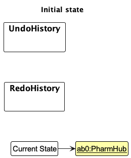

Step 2. The user executes `delete 5` command to delete the 5th person in PharmHub. The `delete` command calls `Model#commitPharmHub()`, causing the modified state of PharmHub after the `delete 5` command executes to be saved in the `pharmHubStateList`, and the `currentStatePointer` is shifted to the newly inserted pharmHub state.

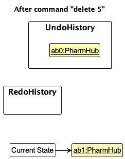

Step 3. The user executes `add n/David …​` to add a new person. The `add` command also calls `Model#commitPharmHub()`, causing another modified pharmHub state to be saved into the `pharmHubStateList`.

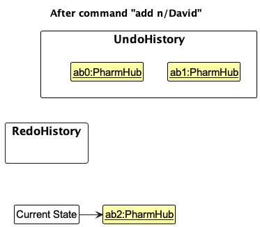

<div markdown="span" class="alert alert-info">:information_source: **Note:** If a command fails its execution, it will not call `Model#commitPharmHub()`, so PharmHub state will not be saved into the `pharmHubStateList`.

</div>

Step 4. The user now decides that adding the person was a mistake, and decides to undo that action by executing the `undo` command. The `undo` command will call `Model#undoPharmHub()`, which will shift the `currentStatePointer` once to the left, pointing it to the previous pharmHub state, and restores PharmHub to that state.

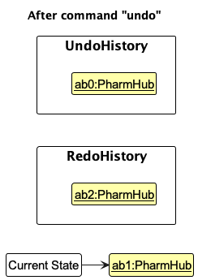

<div markdown="span" class="alert alert-info">:information_source: **Note:** If the `currentStatePointer` is at index 0, pointing to the initial PharmHub state, then there are no previous PharmHub states to restore. The `undo` command uses `Model#canUndoPharmHub()` to check if this is the case. If so, it will return an error to the user rather
than attempting to perform the undo.

</div>

The following sequence diagram shows how the undo operation works:

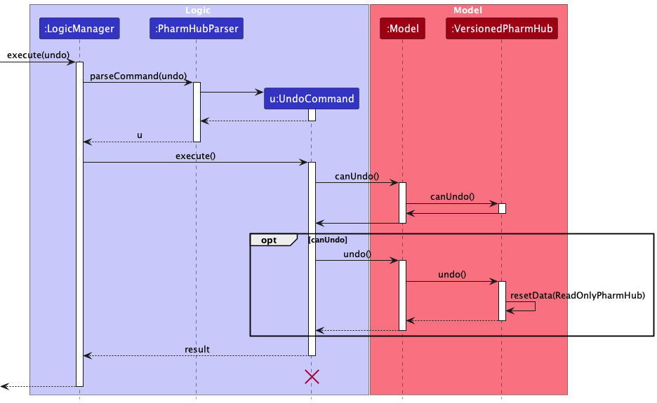

<div markdown="span" class="alert alert-info">:information_source: **Note:** The lifeline for `UndoCommand` should end at the destroy marker (X) but due to a limitation of PlantUML, the lifeline reaches the end of diagram.

</div>

The `redo` command does the opposite — it calls `Model#redoPharmHub()`, which shifts the `currentStatePointer` once to the right, pointing to the previously undone state, and restores PharmHub to that state.

<div markdown="span" class="alert alert-info">:information_source: **Note:** If the `currentStatePointer` is at index `pharmHubStateList.size() - 1`, pointing to the latest pharmHub state, then there are no undone PharmHub states to restore. The `redo` command uses `Model#canRedoPharmHub()` to check if this is the case. If so, it will return an error to the user rather than attempting to perform the redo.

</div>

Step 5. The user then decides to execute the command `list`. Commands that do not modify PharmHub, such as `list`, will usually not call `Model#commitPharmHub()`, `Model#undoPharmHub()` or `Model#redoPharmHub()`. Thus, the `pharmHubStateList` remains unchanged.


Step 6. The user executes `clear`, which calls `Model#commitPharmHub()`. Since the `currentStatePointer` is not pointing at the end of the `pharmHubStateList`, all pharmHub states after the `currentStatePointer` will be purged. Reason: It no longer makes sense to redo the `add n/David …​` command. This is the behavior that most modern desktop applications follow.


The following activity diagram summarizes what happens when a user executes a new command:

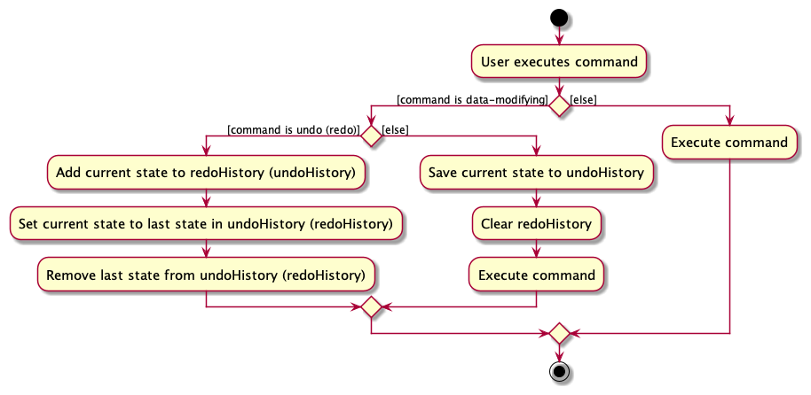

#### Design considerations:

**Aspect: How undo & redo executes:**

* **Alternative 1 (current choice):** Saves the entire pharmHub.
    * Pros: Easy to implement.
    * Cons: May have performance issues in terms of memory usage.

* **Alternative 2:** Individual command knows how to undo/redo by
  itself.
    * Pros: Will use less memory (e.g. for `delete`, just save the person being deleted).
    * Cons: We must ensure that the implementation of each individual command are correct.

_{more aspects and alternatives to be added}_

### \[Proposed\] Data archiving

_{Explain here how the data archiving feature will be implemented}_

### Listing all orders

The listing all orders functionality is supported by the listPanelPlaceholder in the Ui.

On start of application, two listPanels (PersonListPanel, OrderListPanel) is created, and person list panel is attached
to the ListPanel Placeholder as default.

On execution of the any listing commands (`listo` or `listp`), the resultant CommandResult contains details on which
panel to choose to display.

These are 3 different options for these details:
* Person - Panel will display list of people
* Order - Panel will display list of orders
* NoChange - Panel will keep whatever was there previously

Using these specifications, the CommandResult from executing `listo` and `listp` will inform the Ui of which
panel to attach to the listPanelPlaceHolder

--------------------------------------------------------------------------------------------------------------------

## **Documentation, logging, testing, configuration, dev-ops**

* [Documentation guide](Documentation.md)
* [Testing guide](Testing.md)
* [Logging guide](Logging.md)
* [Configuration guide](Configuration.md)
* [DevOps guide](DevOps.md)

--------------------------------------------------------------------------------------------------------------------

## **Appendix: Requirements**

### Product scope

**Target user profile**:

* Pharmacists
* Working remotely

**Value proposition**: Provide easy access to patient details and allows pharmacists to quickly and accurately process
medication orders for the patients, optimised for CLI use.


### User stories

Priorities: High (must have) - `* * *`, Medium (nice to have) - `* *`, Low (unlikely to have) - `*`

| Priority | As a …​                    | I want to …​                                                         | So that I can…​                                                             |
|----------|----------------------------|----------------------------------------------------------------------|-----------------------------------------------------------------------------|
| `* * *`  | Pharmacist                 | Add a new patient into PharmHub                                      | Keep track of all information of my patients                                |
| `* * *`  | Pharmacist                 | Add a medication order for a patient                                 | keep track medications orders of patients                                   |
| `* * *`  | Pharmacist                 | Add allergies of a patient towards certain medications               | keep track of patient allergies                                             |
| `* * *`  | Pharmacist                 | View details of a medication order                                   |                                                                             |
| `* * *`  | Pharmacist                 | View the status of an order                                          | I can track the state of an order                                           |
| `* * *`  | Pharmacist                 | Edit status of an order                                              | Update the order records with the most current information                  |
| `* * *`  | Pharmacist                 | Edit the details of a patient                                        | Update records with the most current information                            |
| `* * *`  | Pharmacist                 | View all medication orders                                           | get a quick overview of all medication orders from all patients             |
| `* * *`  | Pharmacist                 | Delete a patient from my pharmHub                                    | remove a patient that is no longer under my care                            |
| `* * *`  | New user                   | View a summary of all the commands                                   | recall how to use the application                                           |
| `* * *`  | Pharmacist                 | Delete an order from the system                                      | Remove erroneous orders                                                     |
| `* * *`  | Detail-oriented Pharmacist | Be alerted if a patient is given a medication that he is allergic to | Detect and prevent erroneous orders from going through                      |
| `* *`    | Busy Pharmacist            | Abbreviate medication names                                          | Maximise my efficiency                                                      |
| `* *`    | Pharmacist                 | View all details of a patient                                        | get the full patient profile, if required                                   |
| `* *`    | Pharmacist                 | Search orders by various attributes                                  | manage and convey information about orders to stakeholders efficiently      |
| `* *`    | Pharmacist                 | See the number of unfulfilled orders                                 | keep track of my progress in dispensing orders                              |
| `* *`    | Pharmacist                 | Add priorities to orders                                             | keep track of which orders I should prioritise                              |
| `* *`    | Pharmacist                 | Filter orders by their statuses                                      | manage my orders efficiently                                                |
| `* *`    | Pharmacist                 | Sort orders on various categories                                    | maximise my efficiency                                                      |
| `*`      | Pharmacist                 | Edit an order                                                        | correct or update an added order                                            |
| `*`      | Pharmacist                 | Track my medication inventory                                        | I have easy access to the amount of medication I have                       |
| `*`      | Pharmacist                 | Calculate estimated time an order will take to ship                  | Notify patients of an estimated wait time before receiving their medication |
*{More to be added}*

### Use cases

For all use cases below, the **Software System** is the `PharmHub` and the **Actor** is the `user`, unless specified otherwise.

#### **Use case: UC01 - Adding a person**

Guarantees: The new person(patient) will be added to the list of Person.

**MSS**

1. User inputs the command to add a person into the system.
2. PharmHub adds the new person to the person list, displays the updated list and shows the detail information on the information display.
<br>**Use case ends**

**Extensions**

* 1a. User enters an invalid command.

    * 1a1. PharmHub shows an `Unknown Command` error message.
      <br>**Use case ends**


* 1b. User enters a person that already exists.

    * 1b1. PharmHub shows an `User already exist` error message.
<br>**Use case ends**

* 1c. User does not enter a required field.

    * 1c1. PharmHub shows an `Invalid Command Format` error message.
      <br>**Use case ends**


* 1d. User enters an invalid value for a field.

    * 1d1. PharmHub shows an `Field Requirement` error message.
      <br>**Use case ends**


     
#### **Use case: UC02 - Listing Person list**

Guarantees: The Person List would be displayed.

**MSS**

1. User adds a person [UC01](#use-case-uc01---adding-a-person).
2. User inputs command to view the list.
3. PharmHub shows the Person list on the display list.
   <br>**Use case ends**
    
**Extensions**

* 1a. User enters an invalid command.

    * 1a1. PharmHub shows an `Unknown Command` error message.
      <br>**Use case ends**


* 2a. The list is empty.

  Use case ends

#### **Use case: UC03 - Editing Person Detail**

Guarantees: The Person's detail would be updated.

**MSS**

1. User adds a person [UC01](#use-case-uc01---adding-a-person).
2. User views the person list [UC02](#use-case-uc02---listing-person-list).
3. User inputs command to edit a person's detail after looking at the list.
4. PharmHub updates the Person list with the updated Person information and display the person on the detail display.
<br>**Use case ends**


**Extensions**

* 3a. User enters an invalid command.

    * 3a1. PharmHub shows an `Unknown Command` error message.
      <br>**Use case ends**


* 3b. User enters an invalid index.

    * 3b1. PharmHub shows an `Invalid Index` error message.
      <br>**Use case ends**


* 3c. User does not enter at least one field to edit.

    * 3c1. PharmHub shows an error message.
      <br>**Use case ends**


* 3d. User enters an invalid value for a field.

    * 3d1. PharmHub shows an `Field Requirement` error message.
      <br>**Use case ends**


#### **Use case: UC04 - Adding a medicine**

Guarantees: The new medicine will be added to the list of medicines.

**MSS**

1. User inputs the command to add a medicine into the system.
2. PharmHub adds the new medicine to the medicine list.
   <br>**Use case ends**


**Extensions**

* 1a. User enters an invalid command.

    * 1a1. PharmHub shows an `Unknown Command` error message.
      <br>**Use case ends**


* 1b. User enters a medicine that already exists.

    * 1b1. PharmHub shows an `Medicine already exist` error message.
      <br>**Use case ends**


* 1c. User does not enter a required field.

    * 1c1. PharmHub shows an `Invalid Command Format` error message.
      <br>**Use case ends**


#### **Use case: UC05 - Listing Medicine list**

Guarantees: The Medicine List would be displayed.

**MSS**

1. User adds a medicine [UC04](#use-case-uc04---adding-a-medicine).
2. User inputs command to view the medicine list.
3. PharmHub shows the Medicine list on the display list.
   <br>**Use case ends**

**Extensions**

* 2a. User enters an invalid command.

    * 2a1. PharmHub shows an `Unknown Command` error message.
      <br>**Use case ends**


* 2b. The list is empty.
  <br>**Use case ends**


#### **Use case: UC06 - Adding a medicine short form**

Guarantees: The Medicine would have a short form.

**MSS**

1. User adds a Medicine [UC04](#use-case-uc04---adding-a-medicine).
2. User views the person list [UC05](#use-case-uc05---listing-medicine-list).
3. User inputs command to add a short form for medicine base on the index on the list.
4. PharmHub updates Medicine list with a short form for the medicine.
   <br>**Use case ends**

**Extensions**

* 3a. User enters an invalid command.

    * 3a1. PharmHub shows an `Unknown Command` error message.
      <br>**Use case ends**


* 3b. User enters an invalid index.

    * 3b1. PharmHub shows an `Invalid Index` error message.
      <br>**Use case ends**


* 3c. User does not enter a field for short form.

    * 3c1. PharmHub shows an error message.
      <br>**Use case ends**

#### **Use case: UC07 - Deleting a medicine short form**

Guarantees: The short form for the medicine will be removed.

**MSS**

1. User adds a short form [U07](#use-case-uc06---adding-a-medicine-short-form)
2. User inputs command to delete a short form for the medicine base on the index on the list.
3. PharmHub updates Medicine list with an empty short form for the medicine.
<br>**Use case ends**

**Extensions**

* 2a. User enters an invalid command.

    * 2a1. PharmHub shows an `Unknown Command` error message.
      <br>**Use case ends**


* 2b. User enters an invalid index.

    * 2b1. PharmHub shows an `Invalid Index` error message.
      <br>**Use case ends**


#### **Use Case: UC08 - Add an Order for a Person**

Guarantees: The order is added to the person, which can be seen by viewing the order or person

**MSS**

1. User views the person list [UC02](#use-case-uc02---listing-person-list).
2. PharmHub shows a list of persons.
3. User selects a person from the list to assign the order to.
4. User then inputs the add order command.
5. PharmHub adds the new order to the order list, then displays the details on the information display.
   <br>**Use case ends**


**Extensions**

* 4a. The given index to select a patient is invalid.
    * 4a1. PharmHub shows an `Invalid Index` error message. 
    * Use case resumes at step 5.

* 4b. The given medication name is invalid.
    * 4b1. PharmHub shows an `Invalid Medication` error message.
    * Use case resumes at step 5.
  
* 4c. The person is allergic to the input medication
    * 4c1. The user input the wrong medication resulting in the error.
      * 4c1a. PharmHub shows an `Patient Allergy` warning message
      * 4c1b. User edits the command
      * Use case resumes at step 5.
    * 4c2. The User wants to overwrite the warning
      * 4c2a. PharmHub shows an `Patient Allergy` warning message
      * 4c2b. User acknowledges the allergy warning but chooses to proceed by adding an `IA/` (Ignore Allergy) flag to the command.
      * 4c2c. User confirms the order by resubmitting with the `IA/` flag.
      * 4c2d. PharmHub creates the order with the provided information, including the `IA/` flag. 
      * 4c2e. PharmHub confirms the successful creation of the order, noting the allergy warning and the "IA" flag.
      * Use case resumes at step 5.

In this use case, a pharmacist adds a medication order for a patient using PharmHub. 
The system first allows the pharmacist to select a patient from the list and provide order details. 
It then checks for potential contraindications based on the patient's allergies and issues a warning if necessary. 
The pharmacist can acknowledge the warning and proceed with the order by adding an "IA" flag to the command. 
Once confirmed, the system records the order and sends a confirmation to the pharmacist.

#### **Use case: UC09 - Listing Order list**

Guarantees: The Order List would be displayed.

**MSS**

1. User adds an order [UC08](#use-case-uc08---add-an-order-for-a-person).
2. User inputs command to view the order list.
3. PharmHub shows the Order list on the display list.
   <br>**Use case ends**

**Extensions**

* 2a. User enters an invalid command.

    * 2a1. PharmHub shows an `Unknown Command` error message.
      <br>**Use case ends**


* 2b. The list is empty.
  <br>**Use case ends**


#### **Use case: UC10 - Update Order Status**

Guarantees: The order status will be updated

**MSS**

1.  User views the order list [UC09](#use-case-uc09---listing-order-list)
2.  PharmHub shows a list of Order.
3.  User requests to update order status for a order in the list.
4.  PharmHub updates order status for the corresponding order.
    <br>**Use case ends**

**Extensions**

* 2a. The list is empty.
  <br>**Use case ends**


* 3a. The given index is invalid.

    * 3a1. PharmHub shows an `Invalid Index` error message.

      Use case resumes at step 2.

* 3b. The given status is invalid.

    * 3b1. PharmHub shows an `Invalid Status` error message.

      Use case resumes at step 2.

* 3c. The given status is invalid chronological order.

    * 3c1. PharmHub shows an `Invalid Chronological Order` error message.

      Use case resumes at step 2.

#### **Use case: UC11 - Finding person**

Guarantees: The list of person that contains the keywords would be displayed.

**MSS**

1. User added multiple person [UC01](#use-case-uc01---adding-a-person).
2. User wants to find a specific person base on their names.
3. User input find person command.
4. PharmHub filters through the person list following the keywords given from the command input.
5. PharmHub then displays the filtered person list on the list display.
   <br>**Use case ends**

**Extensions**

* 3a. User input invalid command.
  
  * 3a1. PharmHub shows an `Invalid Command` error message
    <br>**Use case ends**


* 4a. The keywords given does not match with any person.

    * 4a1. Empty list is shown.

      Use case resumes at step 2.

#### **Use case: UC12 - Finding orders**

Guarantees: The list of Orders that fulfills the status or medicine or both will be displayed.


**MSS**

1. User added multiple order [UC08](#use-case-uc08---add-an-order-for-a-person).
2. User wants to find a orders base on their status or medicine or both.
3. User input find order command.
4. PharmHub filters through the order list following the status and medicine given from the command input.
5. PharmHub then displays the filtered order list on the list display.
   <br>**Use case ends**


**Extensions**

* 3a. User input invalid command.

    * 3a1. PharmHub shows an `Invalid Command` error message.
      <br>**Use case ends**


* 4a. The status and medicine keyword given does not match with any order.

    * 4a1. Empty list is shown.
      <br>**Use case ends**


* 4b. User input invalid fields.

    * 4b1. User input Invalid Prefix.
      * PharmHub shows an `Invalid Command Format` error message.
      <br>**Use case ends**
    * 4b2. User input Invalid Status.
      * PharmHub shows an `Invalid Status` error message.
        <br>**Use case ends**
    * 4b3. User input non-existent medicine keywords. 
      * PharmHub Displays a empty list.
              <br>**Use case ends**

### Non-Functional Requirements

1. Should work on any _mainstream OS_ as long as it has Java `11` or above installed.
2. A user with above average typing speed for regular English text (i.e. not code, not system admin commands) should be able to accomplish most of the tasks faster using commands than using the mouse.
3. Should be able to hold up to 1000 persons without a noticeable sluggishness in performance for typical usage.
4. Should be able to hold up to 1000 orders without a noticeable sluggishness in performance for typical usage.
5. Should be able to hold up to 1000 medicines without a noticeable sluggishness in performance for typical usage.
6. Application should be a standalone executable so that it doesn't require the user to install other libraries to run.
7. Application should be smaller than 100mb so that application can be run on space constrained systems.
8. Generated storage file shouldn't take up more than 100mb of storage so that the application can be run on space constrained systems.


--------------------------------------------------------------------------------------------------------------------

## **Appendix: Instructions for manual testing**

Given below are instructions to test the app manually.

<div markdown="span" class="alert alert-info">:information_source: **Note:** These instructions only provide a starting point for testers to work on;
testers are expected to do more *exploratory* testing.

</div>

### Launch and shutdown

1. Initial launch

    1. Download the jar file and copy into an empty folder

    1. Double-click the jar file Expected: Shows the GUI with a set of sample contacts. The window size may not be optimum.

1. Saving window preferences

    1. Resize the window to an optimum size. Move the window to a different location. Close the window.

    1. Re-launch the app by double-clicking the jar file.<br>
       Expected: The most recent window size and location is retained.

1. _{ more test cases …​ }_

### Deleting a person

1. Deleting a person while all persons are being shown

    1. Prerequisites: List all persons using the `list` command. Multiple persons in the list.

    1. Test case: `delete 1`<br>
       Expected: First contact is deleted from the list. Details of the deleted contact shown in the status message. Timestamp in the status bar is updated.

    1. Test case: `delete 0`<br>
       Expected: No person is deleted. Error details shown in the status message. Status bar remains the same.

    1. Other incorrect delete commands to try: `delete`, `delete x`, `...` (where x is larger than the list size)<br>
       Expected: Similar to previous.

2. _{ more test cases …​ }_

### Listing all medicines

1. Test case: `listm` <br>
   Expected: All medicines listed in the display panel. "Listed all medicines" shown in result display box.

### Finding medicine(s)

1. Test case: `findm pan` <br> 
   Expected: All medicine whose names have `pan` as a substring listed in the display panel. The number of medicines listed shown in result display box.
2. Test case: `findm pan ol` <br> 
   Expected: All medicine whose names have `pan` or `ol`  as a substring listed in the display panel. The number of medicines listed shown in result display box.


### Adding a medicine

1. Adding a medicine that doesn't exist

    1. Prerequisites: List all medicines using the `listm` command. No medicine named `metformin` should be in the list.

    1. Test case: `addm m/metformin`<br>
       Expected: Medicine is added. Details of added medicine shown in the result display box.

    1. Test case: `addm m/`<br>
       Expected: No medicine is added. Error message shows in result display box.

    1. Other incorrect `addm` commands to try: `addm `, `addm p/`, `addm 1` <br>
       Expected: Similar to previous.

2. Adding a medicine that already exists
    1. Prerequisites: List all medicines using the `listm` command. A medicine named `metformin` should be in the list.
    1. Test case: `addm m/metformin` <br>
       Expected: Medicine is not added. Error message is shown in result display box.
    


### Deleting a medicine

1. Deleting a medicine no person is allergic to and not part of any order. 

    1. Prerequisites: `metformin` should be in the medicine list. Find it using `findm metformin`

    1. Test case: `deletem 1`<br>
       Expected: First medicine is deleted from the list. Details of the deleted medicine is shown in result display box.

    1. Test case: `deletem 0`<br>
       Expected: No medicine is deleted. Error details shown in the result display box.

    1. Other incorrect delete commands to try: `deletem`, `deletem x`, `...` (where x is larger than the list size)<br>
       Expected: Similar to previous.

2. Deleting a medicine a person is allergic to.
    
    1. Prerequisites: `panadol` should be in the medicine list. If not add it using `addm`. At least one person should be allergic to `panadol`.
       If not use `editp` to make a person allergic to `panadol`. Find `panadol` using `findm panadol`
    1. Test case: `deletem 1` <br>
       Expected: No medicine is deleted. Error details shown in the result display box.

### Short form of medicine

1. Adding a short form to a medicine 

    1. Prerequisites: `metformin` should be in the medicine list, it should have no short form and no medicine should have `met` as the short form. Find it using `findm metformin`

    1. Test case: `sfm 1 m/met`<br>
       Expected: Short form of `met` is added to the `metformin` medicine. Details of medicine shown in result display box.
    1. Test case: `sfm 1 met`<br>
          Expected: Short form is not added to the `metformin` medicine. Error message shown in result display box.

2. Deleting a short form of a medicine.

    1. Prerequisites: `metformin` should be in the medicine list, it should have a short form. Find it using `findm metformin`
    1. Test case: `sfm 1 d/` <br>
       Expected: Short form of `metformin` medicine is deleted. Details of medicine shown in result display box.
    1. Test case: `sfm 1 m/ d/` <br>
         Expected: Short form of `metformin` medicine is deleted. Details of medicine shown in result display box.
    1. Test case: `sfm m/ d/` <br>
         Expected: Short form of `metformin` medicine is not deleted. Error message shown in result display box.


### Listing all orders

1. Test case: `listo`
<br> Expected: All orders listed in the display list panel. "Listed all orders" shown in result display box.

### Finding order(s)

1. Test case: `findo s/pd` Finding by status short form only <br>
   Expected: All orders with `PENDING` Status will be listed in the display list panel. The number of orders listed shown in result display box.

2. Test case: `findo s/pending` Finding by status full form only <br>
   Expected: All orders with `PENDING` Status will be listed in the display list panel. The number of orders listed shown in result display box.

3. Test case: `findo m/pan` Finding by one medicine keyword only <br>
   Expected: All orders with medicine whose names have `pan` as a substring will be listed in the display list panel. The number of order listed shown in result display box.

4. Test case: `findo m/pan ol` Finding by multiple medicine keyword <br>
   Expected: All orders with medicine whose names have `pan` or `ol`  as a substring will be listed in the display list panel. The number of orders listed shown in result display box.

5. Test case: `findo s/pd m/pan ol` Finding by both status and medicine keywords <br>
   Expected: All orders that has both `PENDING` status and with medicine whose names have `pan` or `ol` as a substring 
    will be listed in the display list panel(both conditions must be fulfilled). The number of orders listed shown in result display box. 

6. Test case: `findo s/wowow` Invalid Status <br>
   Expected: No orders will be listed in the display list panel. `Invalid Status` error message shown on result display box.

### Adding an order

1. Adding an order that doesn't exist(i.e. Unique OrderNumber)

   1. Prerequisites: List all order using the `listo` command. No order with the order number `1234` should be in the list.
   
   2. Prerequisites: List all person using the `listp` command. Person base on index that is assigned order to should exist.
   
   3. Prerequisites: List all medicine using the `listm` command. Medicine that will be in the order must be in the list.
   
   4. Prerequisites: Person should not be assigned to medicine they are allergy to.
   
   5. Test case: `addo 1 m/pan o/1234` <br>
      Expected: Order is added. Details of the order shown in the Detail information display.
   
   6. Test case: `addo m/pan o/1234` || `addo 1 o/1234` || `addo 1 m/pan` <br>
      Expected: No Order is added due to missing details. `Invalid Command Format`shown in the result display.

   7. Test case: `addo m/` || `addo` <br>
      Expected: Similar to previous.

2. Adding an order that already exists(i.e. OrderNumber already exist)

   1. Prerequisites: List all orders using the `listo` command. An order with order number `1234` should be in the list.
   
   2. Test case: `addo 1 m/pan o/1234` <br>
      Expected: Order is not added. `Order Already exist` Error message is shown in result display box.

3. Adding an order with medicine the person is allergy to.

   1. Prerequisites: List all orders using the `listo` command. An order with order number `2222` should not be in the list.

   2. Prerequisites: List all person using the `listp` command. Pick one person with an allergy and take note.
   
   3. Test case: `addo 1 m/paracetamol` <br>
      Expected: Order is not added. `Patient is Allergy` Warning message will be displayed.

   4. Test case: `addo 1 m/paracetamol ia/` (ignore allergy flag `ia`)<br>
      Expected: Order is added. Details of tht order shown in the Detail information display.

### Updating the order status

1. Updating an order status with valid chronological order.

   1. Prerequisites: List all orders using the `listo` command. The new status should be of a higher chronological order than the old status.
   
   2. Test case: old orderStatus `PENDING`, command: `updates 1 s/pr` <br>
      Expected: Order status updated to `PREPARING`. Details of the updated order is shown in the detail information display box.
   
   3. Test case: old orderStatus `PREPARING`, command: `updates 1 s/completed` <br>
      Expected: Order status updated to `COMPLETED`. Details of the updated order is shown in the detail information display box.

   4. Test case: old orderStatus `COMPLETED`, command: `updates 1 s/pending` <br>
      Expected: Order status not updated. `Invalid Chronological Order` error message shown in result display box.

   5. Test case: old orderStatus `COMPLETED`, command: `updates 1 s/pwpw` <br>
      Expected: Order status not updated. `Invalid Status` error message shown in result display box.

### Deleting an order

1. Deleting an order

   1. Prerequisites: List all orders using the `listo` command. The order to delete should be in the list shown.

   2. Test case: `deleteo 1`<br>
      Expected: First order is deleted from the list. Details of the deleted order is shown in detail information display box.

   3. Test case: `deleteo `<br>
      Expected: No order deleted. `Invalid Command Format` error message shown.

   
### Saving data

1. Dealing with missing/corrupted data files

    1. _{explain how to simulate a missing/corrupted file, and the expected behavior}_

1. _{ more test cases …​ }_

## **Appendix: Planned Enhancements**

1. Currently, to delete a short form a medicine the user has to provide `d/` flag through the `sfm` command to delete the short form
   of a medicine at a specified index. However, if any short form name is provided using the `m/` flag, it will be ignored without any
   warning. Thus, `sfm 1 m/met d/` deletes the short form the medicine at index 1 which ignoring `met`. We plan to make the `sfm` 
   command accept exactly one of `m/` or `d/` flags. This way the command `sfm 1 m/met d/` would be regarded as an invalid command 
   rather than one which deletes the short form. 

2. Currently, when adding a medicine there is no way for the user to specify the short form right then. Hence, the user has to first add
   the medicine followed by using `sfm` command to add a short form to it. We plan to allow `addm` accept an optional parameter for 
   the short form of the medicine being added. 


## **Appendix: Effort**
AB3 only deals with one entity type, `person`. However, our project was harder as we had to deal with three entity types, `person`, 
`order` and `medicine`. All three types are tightly interleaved which caused a lot of challenges during this project.  
Firstly, the dependencies slowed the project timeline as future features required features before it to be finished. This affected 
our ability to work in parallel.   
Secondly, because of the dependencies, we had to take extra precaution in checking the validity of data that is being loaded from the
storage file as a `person` could be allergic to multiple `medicine` and  could hold multiple `order` which in turn could hold multiple
`medicine`.  
{More to be added}


## Glossary

* **Mainstream OS**: Windows, Linux, Unix, OS-X
* **Private contact detail**: A contact detail that is not meant to be shared with others
